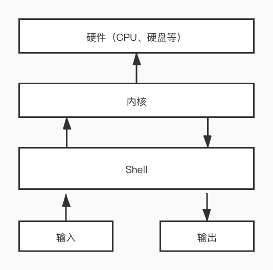

shell是壳程序，负责在用户和Linux内核间建立一道沟通的桥梁。就如信鸽一样，将你要传递的信息，传递给系统内核，内核再将要返回的信息通过信鸽返回给你。  

最直观的就是你看到的各种终端，将你的输入传递给内核，内核再将输出传递到终端屏幕，你可以读取结果。  



shell也是一种程序设计语言，就是将用户输入的命令组合起来执行。shell编程使用最多的应该就是shell编程三剑客，awk、sed、grep。  


## shell分类：
 
### 一、图形化的shell
图形化的shell包括应用最广泛的Windows Explorer以及Linux下使用的X window manager，还有功能更全面的CDE、GNOME、KDE、XFCE。

### 二、命令行式的shell
命令行式的shell有很多，常见的有：
* Bourne Shell (sh)
* Korn Shell (ksh)
* Bourne Again Shell (bash)
* C Shell (csh)
* TENEX/TOPS C Shell (tcsh)  

> bash现在是大部分系统的标配shell

如何查看自己的系统有哪几种可用的shell
```
cat /etc/shells
# 输出如下：
/bin/sh
/bin/bash
/usr/bin/sh
/usr/bin/bash
```

如何查看自己的系统目前正在使用的shell
```
echo $SHELL
# 输出如下：
/bin/bash
```

如何切换使用的shell
```
# 切换到csh
chsh -s /bin/csh
# 切换回bash
chsh -s /bin/bash
```
> 命令如何记：ch->change   sh->shell   组合起来change shell shell的路径

## 常用的shell命令
* cd: 目录切换
* ls: 列出目录下的文件，-a参数可以查看隐藏文件
* mkdir: 创建目录
* rmdir: 删除空目录
* rm: 删除目录或者文件（慎用）
* pwd: 列出当前的目录全路径
* cat: 查看文件内容
* echo: 输出内容到屏幕
* env: 列出系统环境变量
* cp: 拷贝文件或者目录
* mv: 移动文件或者目录（可以用来重命名文件）
